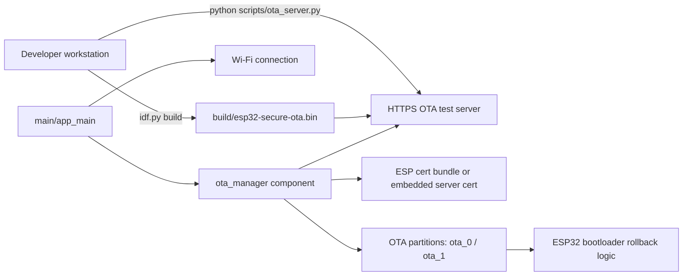
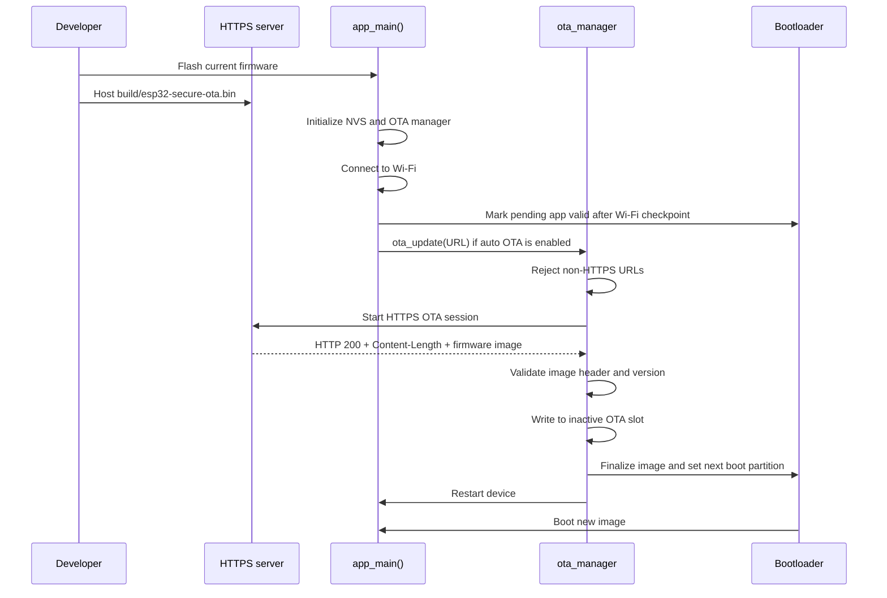

# Secure HTTPS OTA Firmware Update System for ESP32

This repository demonstrates a secure-minded over-the-air firmware update workflow for ESP32 using ESP-IDF. The project combines a modular OTA manager, dual OTA partitions, rollback-aware boot behavior, and a small HTTPS firmware server for local testing. It is positioned as a portfolio and learning project that explores safer firmware delivery over HTTPS rather than a production-ready device management platform.

## Why This Project Matters

OTA updates are essential for connected devices because firmware bugs, security fixes, and feature changes often need to be deployed after hardware is already in the field. In embedded systems, the update path itself becomes part of the security boundary. This project focuses on that boundary by requiring HTTPS, validating firmware metadata before flashing, and using ESP-IDF rollback support to reduce the chance of leaving a device in a broken state.

## Key Features

- Modular OTA logic isolated in `components/ota_manager`.
- HTTPS-only firmware downloads through `esp_https_ota`.
- Server trust through either the ESP x509 certificate bundle or a locally embedded server certificate.
- OTA response validation for HTTP status, content length, and target partition size.
- Early firmware descriptor inspection with `esp_app_desc_t`.
- Same-version update skip based on the running and incoming firmware version strings.
- Dual-slot OTA partition table for A/B style updates on 4 MB flash.
- Bootloader rollback support enabled, with app validity confirmed after a Wi-Fi checkpoint.
- Lightweight Python HTTPS server for LAN-based OTA testing.

## Technology Stack

| Area | Implementation |
| --- | --- |
| MCU | ESP32 |
| SDK | ESP-IDF v5.3.3 verified locally |
| Language | C |
| Build system | CMake with `idf.py` |
| OTA transport | `esp_https_ota` over HTTPS |
| Networking | ESP-IDF Wi-Fi stack with `protocol_examples_common` |
| Local tooling | Python 3 test server in `scripts/ota_server.py` |
| Flash layout | Custom partition table with `ota_0` and `ota_1` |

## High-Level Architecture



## OTA Update Flow



## Repository Structure

```text
.
|-- CMakeLists.txt
|-- README.md
|-- CHANGELOG.md
|-- CONTRIBUTING.md
|-- sdkconfig.defaults
|-- partition_table/
|   `-- partitions.csv
|-- main/
|   |-- CMakeLists.txt
|   |-- Kconfig.projbuild
|   `-- main.c
|-- components/
|   `-- ota_manager/
|       |-- CMakeLists.txt
|       |-- ota_manager.c
|       `-- ota_manager.h
|-- scripts/
|   `-- ota_server.py
`-- docs/
    |-- ARCHITECTURE.md
    |-- OTA_WORKFLOW.md
    |-- PORTFOLIO_NOTES.md
    |-- SECURITY.md
    |-- SETUP.md
    `-- TROUBLESHOOTING.md
```

## Build Requirements

- ESP32 development board with at least 4 MB flash.
- ESP-IDF installation with `idf.py` available in the shell.
- Python 3 for the local HTTPS firmware server.
- A Wi-Fi network reachable by both the ESP32 and the OTA host machine.
- An HTTPS endpoint serving the firmware image, either public or local.

## Build, Flash, and Monitor

The current project was built successfully in this workspace with ESP-IDF v5.3.3.

```bash
idf.py menuconfig
idf.py build
idf.py -p COM3 flash
idf.py -p COM3 monitor
```

For a full setup walkthrough, see [docs/SETUP.md](docs/SETUP.md).

## OTA Firmware Update Workflow

1. Build the firmware with `idf.py build`.
2. Configure Wi-Fi credentials and the firmware URL through `idf.py menuconfig`.
3. Serve `build/esp32-secure-ota.bin` from an HTTPS endpoint.
4. Enable `Run OTA check automatically on boot` if you want the device to check for updates during startup.
5. Reboot the ESP32 and monitor logs during the update sequence.

Detailed behavior is documented in [docs/OTA_WORKFLOW.md](docs/OTA_WORKFLOW.md).

## Configuration Notes

- The OTA URL is compiled into firmware through `CONFIG_EXAMPLE_FIRMWARE_UPGRADE_URL`.
- Auto-update on boot is disabled by default.
- `sdkconfig.defaults` uses placeholders and does not store real Wi-Fi credentials.
- If `certs/ota_server_cert.pem` exists at build time, the OTA component embeds that certificate and uses it for server authentication.
- Without a local embedded certificate, the project falls back to the ESP-IDF certificate bundle when `CONFIG_EXAMPLE_USE_CERT_BUNDLE=y`.

## Security Notes

- The OTA manager rejects plain HTTP URLs.
- The code checks for an HTTP `200` response before writing the image.
- The image size must be known, positive, and smaller than the target OTA partition.
- The incoming firmware descriptor is read before the full image is accepted.
- Rollback support is enabled, but firmware signing, Secure Boot, Flash Encryption, and anti-rollback are not enabled by default.

The full security posture is documented in [docs/SECURITY.md](docs/SECURITY.md).

## Known Limitations

- OTA is only triggered automatically at boot when explicitly enabled in menuconfig.
- The firmware source is a static URL baked into the build rather than a manifest or device-management service.
- Version handling only skips exact same-version images; it does not enforce semantic ordering.
- The included Python HTTPS server is for local development and manual testing, not device fleet management.
- The repository does not yet enable firmware signing, Secure Boot, Flash Encryption, or CI-based release validation.

## Future Improvements

- Add signed firmware verification with keys stored outside the repository.
- Add a manifest-driven update policy with explicit version and channel handling.
- Add Secure Boot and Flash Encryption for stronger device hardening.
- Add release automation and validation checks in CI.
- Add a safer runtime trigger model instead of relying only on boot-time update checks.

## Engineering Highlights

- Separated OTA behavior into a reusable component instead of placing all update logic in `main.c`.
- Added practical validation gates before flash writes, including transport, response, size, and version checks.
- Used ESP-IDF rollback support with a clear post-boot validation checkpoint.
- Preserved a small local test loop with a Python HTTPS server to make end-to-end OTA testing reproducible.

## Documentation Map

- [docs/ARCHITECTURE.md](docs/ARCHITECTURE.md)
- [docs/OTA_WORKFLOW.md](docs/OTA_WORKFLOW.md)
- [docs/SECURITY.md](docs/SECURITY.md)
- [docs/SETUP.md](docs/SETUP.md)
- [docs/TROUBLESHOOTING.md](docs/TROUBLESHOOTING.md)
- [docs/PORTFOLIO_NOTES.md](docs/PORTFOLIO_NOTES.md)

## Suggested GitHub Topics

`esp32`, `esp-idf`, `ota-update`, `https-ota`, `embedded-c`, `iot-security`, `firmware-update`, `cmake`, `embedded-systems`

## License

No license file is currently included in the repository. Add an explicit license before treating the project as reusable open-source code.
