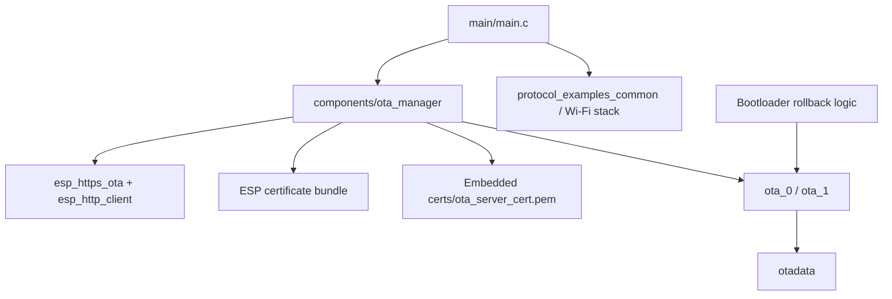
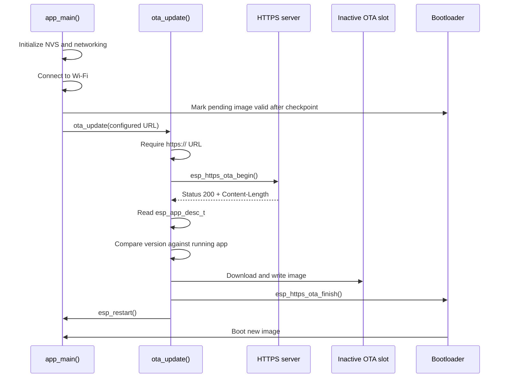

# Architecture

## System Overview

This project is structured as a small ESP-IDF application plus a dedicated OTA component. The runtime flow is intentionally simple:

1. `app_main()` initializes NVS and the OTA subsystem.
2. The device brings up networking and connects to Wi-Fi.
3. If the current firmware is pending verification, the app marks it valid after a successful Wi-Fi checkpoint.
4. If boot-time OTA is enabled, the app delegates update handling to `ota_update()`.
5. The OTA component validates the HTTPS response and writes the image to the inactive OTA slot.

## Main Firmware Components

| Component | File | Responsibility |
| --- | --- | --- |
| Application entry point | `main/main.c` | Boot banner, NVS init, network init, Wi-Fi connect, rollback checkpoint, optional OTA trigger |
| OTA public interface | `components/ota_manager/ota_manager.h` | Declares `ota_init()` and `ota_update()` |
| OTA implementation | `components/ota_manager/ota_manager.c` | HTTPS-only OTA flow, response validation, image descriptor check, version check, reboot |
| OTA build integration | `components/ota_manager/CMakeLists.txt` | Registers dependencies and embeds `certs/ota_server_cert.pem` when present |
| Configuration menu | `main/Kconfig.projbuild` | OTA URL, auto OTA on boot, certificate bundle option |
| Default configuration | `sdkconfig.defaults` | Custom partition table, 4 MB flash, rollback, HTTPS defaults, placeholder Wi-Fi values |
| Partition table | `partition_table/partitions.csv` | Defines `nvs`, `otadata`, `phy_init`, `ota_0`, and `ota_1` |
| Local OTA host | `scripts/ota_server.py` | Serves `build/esp32-secure-ota.bin` over HTTPS for development testing |

## OTA Manager Component

The OTA manager is the core of the project:

- `ota_init()` logs the current running partition, version, and selected HTTPS trust source.
- `ota_update()` refuses any URL that does not start with `https://`.
- The component starts an OTA session with `esp_https_ota_begin()`.
- It checks the HTTP status code before accepting the response.
- It checks `Content-Length` and ensures the incoming image fits in the target OTA partition.
- It reads the incoming `esp_app_desc_t` with `esp_https_ota_get_img_desc()` before completing the download.
- It skips the update if the incoming version string matches the running version.
- It completes the update with `esp_https_ota_finish()` and then restarts the device.

## Application Entry and OTA Interaction

`main/main.c` keeps application-level responsibilities separate from OTA mechanics:

1. Initialize NVS, erasing and reinitializing if the storage layout changed.
2. Call `ota_init()` to log running image information.
3. Initialize `esp_netif` and the default event loop.
4. Connect to Wi-Fi through `example_connect()`.
5. If the image is in `ESP_OTA_IMG_PENDING_VERIFY`, mark it valid with `esp_ota_mark_app_valid_cancel_rollback()` after Wi-Fi is up.
6. If `CONFIG_EXAMPLE_AUTO_OTA_ON_BOOT=y`, call `ota_update(CONFIG_EXAMPLE_FIRMWARE_UPGRADE_URL)`.

This split keeps boot logic small and makes the OTA behavior easier to reason about and extend.

## Partition Table

The project uses a custom partition table sized for 4 MB flash:

| Partition | Type | Offset | Size | Purpose |
| --- | --- | --- | --- | --- |
| `nvs` | data | `0x9000` | `0x4000` | Non-volatile storage |
| `otadata` | data | `0xd000` | `0x2000` | OTA boot metadata |
| `phy_init` | data | `0xf000` | `0x1000` | PHY calibration data |
| `ota_0` | app | `0x10000` | `0x1F0000` | OTA application slot A |
| `ota_1` | app | `0x200000` | `0x1F0000` | OTA application slot B |

There is no dedicated factory app partition in this layout. Initial flashing writes the application directly into the first OTA slot, and future updates alternate between `ota_0` and `ota_1`.

## Firmware Update Lifecycle

1. A firmware image is built as `build/esp32-secure-ota.bin`.
2. The image is hosted on an HTTPS endpoint.
3. The ESP32 boots, joins Wi-Fi, and optionally starts an OTA session.
4. The OTA manager selects the inactive OTA slot.
5. The OTA manager validates transport, response metadata, and the incoming app descriptor.
6. ESP-IDF writes the image into the selected OTA partition.
7. `esp_https_ota_finish()` validates the completed image and sets the next boot partition.
8. The device restarts into the new image.
9. On the next boot, the app confirms the image as valid after the Wi-Fi checkpoint.

## Error Handling Behavior

| Condition | Current behavior |
| --- | --- |
| URL is missing or not HTTPS | Rejects update with `ESP_ERR_INVALID_ARG` |
| No trust source is configured | Rejects update with `ESP_ERR_INVALID_STATE` |
| No OTA partition is available | Returns failure before download |
| HTTP status is not `200` | Aborts the OTA session |
| `Content-Length` is missing, zero, or negative | Aborts the OTA session |
| Firmware is larger than the target slot | Aborts the OTA session |
| App descriptor cannot be read | Aborts the OTA session |
| Incoming version equals running version | Skips OTA and returns `ESP_OK` |
| Download does not complete | Aborts with an invalid-size style error |
| `esp_https_ota_finish()` fails | Returns the ESP-IDF error and does not restart |

## Component Diagram

## OTA Sequence Diagram

